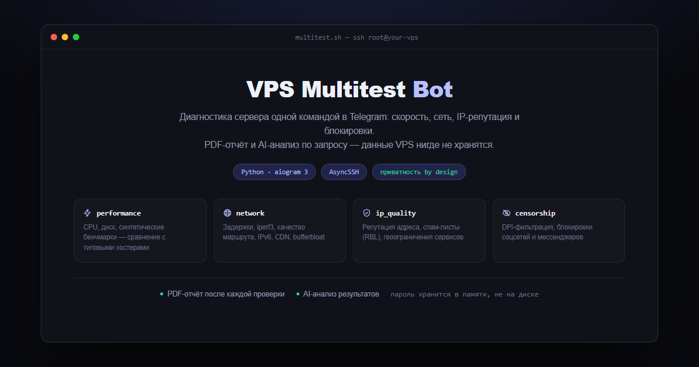
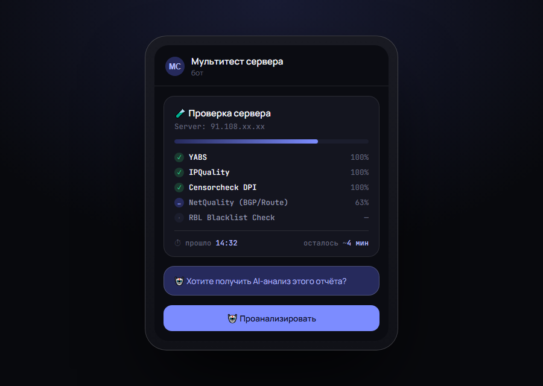

# VPS Multitest Bot



Telegram-бот, который подключается по SSH к серверу пользователя, прогоняет набор из 25
диагностических тестов (скорость, устойчивая нагрузка, UDP/QUIC-throttling, bufferbloat, IPv6,
DNS-перехват, IP-репутация, гео/DPI-блокировки, бенчмарки — часть из
[saveksme/multitest](https://github.com/saveksme/multitest), часть — независимые community-скрипты),
формирует понятный PDF-отчёт и по запросу даёт краткий AI-анализ через OpenRouter.

Можно потестить прямо сейчас: [@multitest_vps_bot](https://t.me/multitest_vps_bot).

**Данные VPS (IP/порт/логин/пароль) нигде не сохраняются и никуда не пересылаются** — только
оперативная память на время самого теста. Подробности — в разделе «Безопасность» ниже.

## Быстрый старт

Установка одной командой (клонирует репозиторий, спросит `BOT_TOKEN`/`ADMIN_ID`,
сгенерирует `MASTER_ENCRYPTION_KEY` и поднимет контейнер через `docker compose`):

```bash
curl -fsSL https://raw.githubusercontent.com/Theraf1u/vps-multitest-bot/main/install.sh | bash
```

Либо вручную:

```bash
git clone https://github.com/Theraf1u/vps-multitest-bot.git
cd vps-multitest-bot
cp .env.example .env
# заполнить BOT_TOKEN, ADMIN_ID, MASTER_ENCRYPTION_KEY (и опционально OPENROUTER_*)
docker compose up -d --build
```

## Переменные окружения (.env)

| Переменная | Обязательна | Описание |
|---|---|---|
| `BOT_TOKEN` | да | токен из @BotFather |
| `ADMIN_ID` | да | ваш числовой Telegram user id — доступ к админ-панели |
| `MASTER_ENCRYPTION_KEY` | да | любая секретная строка, шифрует OpenRouter key в БД |
| `OPENROUTER_MODEL` | нет | модель по умолчанию, меняется из админки |
| `OPENROUTER_API_KEY` | нет | ключ по умолчанию, меняется из админки (хранится в БД зашифрованным) |
| `MAX_CONCURRENT_TESTS` | нет | сколько тестов может идти одновременно (глобально); сверх лимита — очередь, не отказ |
| `MAX_TESTS_PER_USER` | нет | тестов на одного пользователя одновременно (по умолчанию 1) |
| `TELEGRAM_PROXY_URL` / `OPENROUTER_PROXY_URL` / `SSH_PROXY_URL` | нет | SOCKS5/HTTP-прокси, если что-то из этого заблокировано на вашем хосте |
| `SSH_CONNECT_TIMEOUT` | нет | таймаут SSH-подключения, сек |
| `REPORT_TTL_HOURS` | нет | через сколько часов удалять временные PDF из `REPORTS_DIR` |
| `ARCHIVE_DIR` | нет | постоянный архив отчётов (не кредов — см. «Безопасность») |

Дневной лимит отчётов на пользователя и назначение premium-эмодзи на кнопки настраиваются не
через `.env`, а прямо из админ-панели бота (см. ниже).

## Как это работает



1. Пользователь жмёт «🚀 Проверить сервер», вводит IP/порт/логин/пароль по шагам (FSM). Для
   порта есть кнопка «Стандартный 22», для логина — кнопка «👤 root».
2. На экране подтверждения — «🚀 Все тесты (25)» или «🎯 Выбрать тесты»: инлайн-чеклист по
   категориям (заголовок категории кликабелен — выбирает/снимает всю группу разом), кнопки
   «✅ Все» / «🚫 Ничего» для массового выбора.
3. Если слоты (`MAX_CONCURRENT_TESTS`) заняты — пользователь встаёт в очередь с live-позицией
   и кнопкой «🚫 Покинуть очередь», а не получает отказ. Тест стартует автоматически, как
   только освобождается слот.
4. Бот проверяет TCP-доступность, логинится по SSH (AsyncSSH), берёт SHA256-отпечаток
   хоста и просит подтвердить его при первом подключении или при изменении.
5. Проверяет root/passwordless sudo, собирает базовые факты о системе (ОС, hostname, CPU, RAM, диск).
6. Загружает **pinned**-копию `vendor/multitest.sh` на сервер по SFTP и подключает её функции
   (`MULTITEST_TEST=1 source vendor.sh`), но **не вызывает `run_all()`** — у него нет non-interactive
   режима с частичным выбором тестов. Вместо этого бот сам гоняет только выбранные функции
   (`capture_test`, `parse_test_output`, `install_deps_for`, ...) в нужном порядке — та же логика
   тестов из оригинального скрипта, просто без интерактивного меню-обвязки. Отдельные
   community-тесты (bench.gig.ovh, speed.tlab.pw, DPI Detector, IP Region альтернативы,
   Region Restriction, RBL-check, NetQuality и др.) запускаются тем же механизмом как обычные
   shell-команды — их сырой вывод идёт в PDF отдельным разделом.
7. Пока тесты идут, бот раз в несколько секунд опрашивает каталог результатов и обновляет одно
   сообщение с прогресс-баром — по каждому тесту отдельная строка с % и sub-progress-баром,
   плюс прошедшее время и ETA всего прогона (кнопка «❌ Остановить тест» — прерывает и подчищает
   временные файлы на сервере).
8. После завершения — скачивает результаты, удаляет всё временное на сервере, рендерит PDF
   (Jinja2 + WeasyPrint), присылает его в чат и кладёт копию в постоянный архив отчётов.
9. Отдельной кнопкой (не автоматически) можно попросить AI-анализ через OpenRouter — компактный
   агрегированный JSON без сырых логов, до 2 анализов на один прогон (сразу после теста и
   ещё раз из истории).

## Тесты и категории

25 тестов сгруппированы в 4 категории (⚡ Производительность, 🌍 Сеть, 🔐 IP Quality,
🛡 Censorship/DPI) — полный список с оценкой времени каждого доступен пользователю прямо в
главном меню бота, а с короткими описаниями — по кнопке «📋 Описание тестов». Источник истины
для каталога — `bot/services/multitest.py::TEST_CATALOG` / `CATEGORIES`.

## История, лимиты и AI

- «📜 История» в главном меню — прошлые проверки (дата/сервер/статус), по каждой — повтор
  (кнопка «🔄 Повторить», см. «Безопасность» — заново спросит логин/пароль), присылка PDF
  повторно, AI-анализ (если ещё не исчерпан лимит на этот прогон).
- Дневной лимит успешных отчётов на пользователя настраивается в админке
  («⚙️ Админ-панель → 📅 Лимит отчётов/сутки», 0 — без лимита) и виден пользователю на экране
  подтверждения запуска («📅 Отчётов сегодня: N/M»).
- Каждый успешный прогон архивируется **навсегда** (не подчищается по `REPORT_TTL_HOURS`, в
  отличие от `REPORTS_DIR`) в `ARCHIVE_DIR/<telegram_id>/reports/`: PDF-копия, текстовый дамп
  сырых метрик, при наличии — текст AI-анализа. Ни логина, ни пароля там нет.

## Чаты и топики (пересылка событий админу)

«⚙️ Админ-панель → 📡 Чаты и топики» — один Chat ID (форум-группа с включёнными топиками) и
отдельный topic id под каждую категорию событий: PDF-отчёты, регистрации, ошибки тестов,
старты тестов (только host:port, без кредов), AI-анализы, срабатывания лимитов, системные
события. Кнопка «🧵 Создать все топики автоматически» создаёт недостающие топики через Bot API
сама (нужны права бота «Manage Topics» в группе) — вручную искать id через @userinfobot не
обязательно. Если Chat ID не задан — пересылка выключена (по умолчанию).

## Премиум-эмодзи на кнопках

«⚙️ Админ-панель → 💎 Премиум-эмодзи на кнопках» — выбираете кнопку, присылаете сообщение с
premium-эмодзи, бот сам достаёт `custom_emoji_id` из entity и подставляет на кнопку
(`InlineKeyboardButton.icon_custom_emoji_id`). Работает только если у владельца бота
(аккаунта в BotFather) есть Telegram Premium, либо у бота куплены доп. юзернеймы на Fragment —
иначе Telegram молча игнорирует поле.

## Очередь и защита от флуда

- Сверх `MAX_CONCURRENT_TESTS` — очередь (FIFO, live-позиции), а не hard reject.
- SQLite работает в WAL-режиме с `busy_timeout` — конкурентные тесты не блокируют друг друга
  на запись/чтение БД.
- Общий throttling-middleware (`bot/middlewares/throttling.py`) — кулдаун на пользователя на
  `/start` и инлайн-кнопки, чтобы один пользователь не мог флудить бота без всякой цены.
  Обработка флуд-контроля самого Telegram (`TelegramRetryAfter`) на прогресс-барах — с
  единичным retry вместо падения таски.

## Обновление бота

```bash
bash update.sh          # проверить и, если есть новая версия, обновить + пересобрать
bash update.sh --check  # только проверить, ничего не трогая
```

Делает `git fetch` + сравнение с `origin/main`; если есть новые коммиты — показывает их список,
подтягивает (`git pull --ff-only`), пересобирает образ и пересоздаёт контейнер. Без аргументов
и без новых коммитов ничего не делает и просто сообщает, что версия актуальна.

## Обновление pinned-скрипта

Бот **никогда** не скачивает свежий `multitest.sh` на сервер пользователя напрямую — только
committed-копию из `vendor/multitest.sh`. Обновление — ручное действие админа:
«⚙️ Админ-панель → 🧪 Multitest → 🔍 Проверить обновление / ⬆️ Обновить pinned script».

⚠️ `bot/services/multitest.py::TEST_CATALOG` жёстко задаёт порядок и имена функций тестов
пиненного скрипта (нужно, чтобы вычислять прогресс без tty). Если апстрим когда-нибудь
переименует/переставит тесты — после обновления pinned-скрипта нужно поправить и этот список.

## Безопасность

- **Данные VPS никогда не сохраняются и никуда не пересылаются.** Хост/порт/логин/пароль живут
  только в памяти процесса на время одного теста (не в FSM storage, не в БД, не в файлах на
  диске, не в логах) и явно затираются сразу после завершения/отмены/ошибки теста. Сообщение
  с паролем в Telegram удаляется сразу после получения. В постоянном архиве
  (`ARCHIVE_DIR/<id>/reports/`) хранятся только результаты тестов — PDF, сырой текстовый дамп
  метрик и AI-анализ, ни хоста с паролем, ни отдельно пароля там нет. Единственное, что
  остаётся про сервер — host/port в таблице истории (`TestRun`) и в уведомлениях в топик
  `test_starts`, чтобы работали история/повтор/мониторинг; логин и пароль не сохраняются даже
  там. Из-за этого «🔄 Повторить» в истории каждый раз заново спрашивает логин и пароль — это
  осознанный компромисс в пользу приватности, а не недоработка.
- OpenRouter API key хранится в БД зашифрованным (Fernet, ключ выводится из `MASTER_ENCRYPTION_KEY`).
- В OpenRouter уходит только компактный агрегированный JSON с результатами тестов — не сырые
  терминальные логи и не данные для входа на сервер.
- SSRF-защита (`bot/services/security.py`): резолв хоста и блокировка loopback/private/link-local/
  metadata-адресов, повторная проверка уже после установления TCP-соединения.
- Rate-limit: `MAX_TESTS_PER_USER` активных тестов на пользователя, `MAX_CONCURRENT_TESTS` —
  глобально (сверх — очередь), плюс админ-настраиваемый дневной лимит отчётов на пользователя.

## Офлайн-сборка образа (опционально)

Если у хоста, где разворачивается бот, нет надёжного доступа к PyPI/deb-репозиториям во время
`docker build` (так было при разработке этого бота — см. историю коммитов), можно завендорить
зависимости заранее вместо обычного сетевого `pip install`/`apt-get`:

- `wheels/` — все зависимости из `requirements.txt` как `manylinux`-колёса под
  `cp312`/`linux_x86_64`, ставятся через `pip install --no-index --find-links=./wheels`.
- `debs/` — Pango/GDK-pixbuf/Cairo и их транзитивные зависимости для Debian
  (WeasyPrint рендерит страницы чистым Python, но текст всё ещё шейпит через Pango по cffi),
  ставятся через `dpkg -i ./debs/*.deb`.

Обе папки — в `.gitignore` (бинарные, платформо-специфичные, незачем тащить в git). Собрать их:

```bash
pip download -r requirements.txt -d wheels \
  --platform manylinux2014_x86_64 --python-version 312 --implementation cp --abi cp312 \
  --only-binary=:all:
```

(запускать с машины с нормальным доступом в интернет — не обязательно с целевого хоста).
Если у вашего хоста доступ в интернет нормальный — просто пропустите этот раздел, `Dockerfile`
и так использует `wheels/`/`debs/`, если они есть, но обычный `docker compose up -d --build` с
пустыми папками тоже отработает через сеть (поправьте `Dockerfile`, если хотите чистый
`pip install -r requirements.txt` без офлайн-схемы).

## Структура проекта

```
bot/
  handlers/     start.py, test_flow.py, history.py, admin.py
  services/     ssh.py, multitest.py, openrouter.py, report.py, security.py, crypto.py,
                archive.py, notify.py, button_icons.py, test_info.py
  middlewares/  throttling.py
  database/     models.py, db.py, crud.py
  templates/    report.html
vendor/
  multitest.sh  pinned-копия апстрима
```
